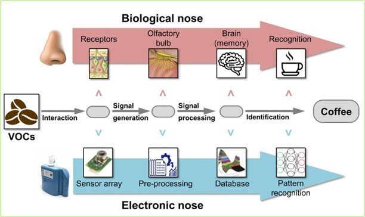
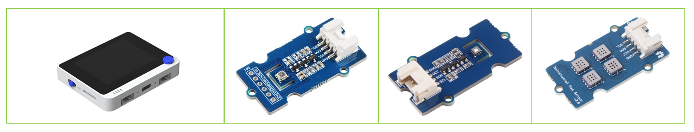
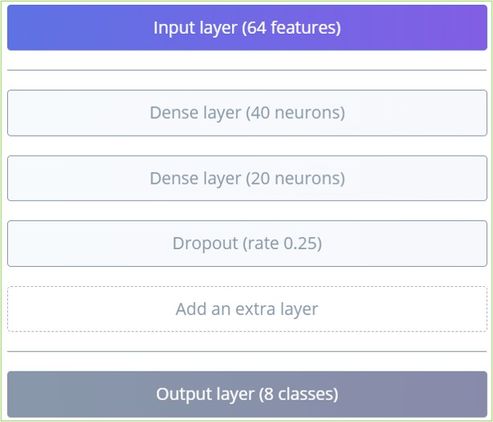
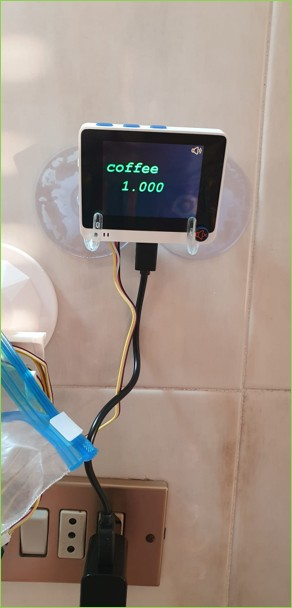
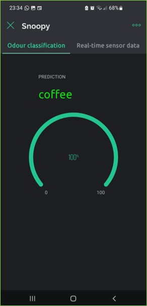
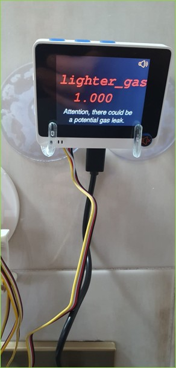
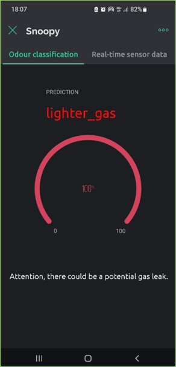
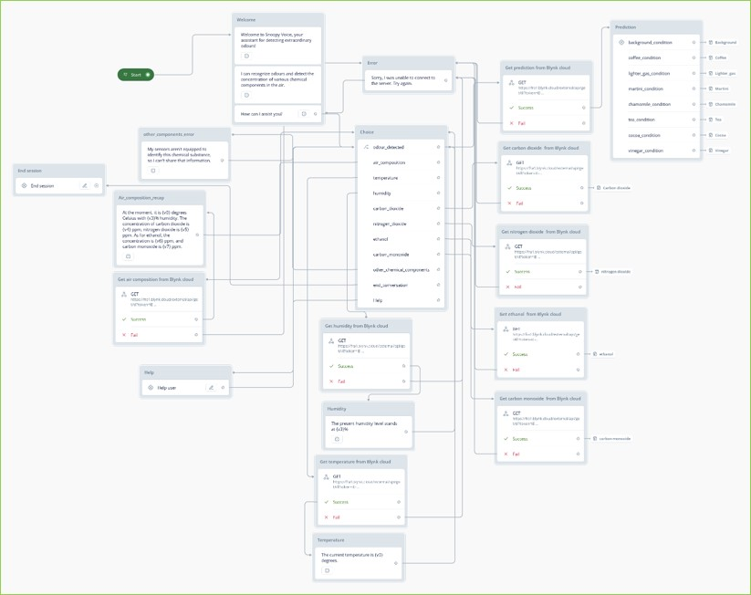
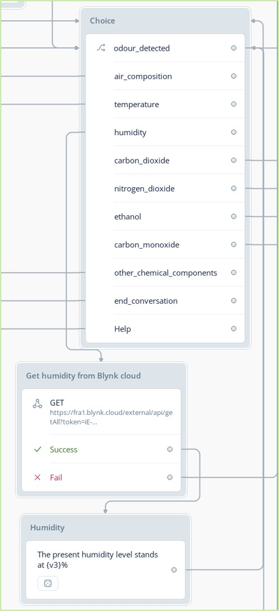

# 🐶 SNOOPY – The Electronic Hound  

> An innovative project that highlights a too-often underestimated sense: **smell**.  

---

## 🌸 Introduction  

The sense of smell strongly influences our emotions and even our taste perception (**about 80%** of what we taste actually comes from smell).  
It’s not only about emotions: detecting odors can save our lives, for example by recognizing a **gas leak**.  

  

This is why we created **SNOOPY**, our **electronic nose**, integrated with:  
- 📱 **Mobile App** for remote monitoring  
- 🎙️ **Alexa Skill** for voice interaction  

---

## 🛠️ System Architecture  

The project is based on **4 main components**:

1. 🤖 **Electronic Nose**  
   - Microcontroller **Wio Terminal**  
   - Sensors to detect the chemical composition of the air  
   - Odor classification capability  
   - Internet connectivity + integrated display

  

2. ☁️ **Blynk Cloud**  
   - Data storage and management  
   - Real-time remote access  

3. 📱 **Smartphone Application (Blynk)**  
   - Visualization of data and detected odors  
   - Real-time chemical monitoring through widgets  
   - Sound and haptic notifications in case of critical events  

4. 🎙️ **Alexa Skill**  
   - Voice interaction through commands  
   - HTTP GET requests to Blynk  
   - Spoken responses about current odors and air composition  

  

---

## 🔌 Hardware Used  

- 🧠 **Wio Terminal** (microcontroller, display, WiFi connectivity)

- 🌫️ **Grove - Gas Sensor V2 (Multichannel)**  
  - CO (Carbon Monoxide)  
  - NO2 (Nitrogen Dioxide)  
  - Ethanol (C2H5CH)  
  - VOC (Volatile Organic Compounds)

- 🌱 **Grove - VOC & eCO2 Gas Sensor (SGP30)**  
  - Measures **TVOC** and **CO2**

- 🌡️ **Grove - Temperature Humidity Pressure Gas (BME680)**  
  - Temperature  
  - Pressure  
  - Humidity
 

  

---

## 👃 Odors Classified  

The system can distinguish **8 odor classes**:  

- 🌫️ Background (neutral air)  
- ☕ Coffee  
- 🍶 Vinegar  
- 🍸 Martini (alcoholic beverage)  
- 🌼 Chamomile  
- 🍵 Tea  
- 🔥 Lighter Gas  
- 🍫 Cocoa  

👉 In particular, **lighter gas** detection was designed as a simulation of a **gas leak**.  

---

## 📊 Data Collection  

- 🔢 **8 odors × 9 measurements** each  
- 📍 Locations: **Pofi (FR)** and **Cori (LT)**  
- 🌦️ Variable **humidity, temperature, and time of day**  
- 🗃️ Final dataset: **86,912 instances**  

---

## ⚙️ Preprocessing & AI  

1. 🔄 **Normalization** of data (range 0–1)  
2. 🧑‍💻 **Edge Impulse** used for training  
   - 80% training, 20% testing  
   - Algorithm: **Neural Network** (hyperparameter tuned)  
   - Training: **300 epochs** – LR = 0.0005  

3. 🚨 **Anomaly Detector** to reduce misclassifications  

 

### 📈 Results  
- **Overall Accuracy**: 98%  
- **F1-score**:  
  - Chamomile: 0.94  
  - Cocoa: 0.98  
  - Tea: 0.97  
- 💡 **Lighter gas** detection highly reliable (crucial for safety).  

 

---

## 🔄 System Workflow  

1. 📡 Acquisition of raw sensor data  
2. 📥 Normalization → buffer  
3. 🤖 Inference through classifier  
4. 🚨 Anomaly detection for noisy data  
5. 📲 Data sent to Blynk Cloud + displayed in the app  
6. 🎙️ Voice responses via Alexa  

---

## 📱 Mobile Application  

- Platform: **Blynk IoT**  
- 🎛️ Gauge widgets for chemical values and thresholds  
- ✅ Green = normal condition  
- ❌ Red = critical condition  
- 🔔 Sound + haptic notifications  
- 🔇 Sound toggle via **Wio Terminal button** (icon updates on screen).  
 

  
  
  
  

---

## 🎙️ Alexa Skill  

- Built with **Voiceflow**  
- Activation: **“Alexa, open Snoopy Voice”**  
- Available functions:  
  - Ask for the **current odor**  
  - Ask for **full air composition**  
  - Ask for single values (**CO, Ethanol, Temperature**, etc.)  
- Error handling and adaptive responses  

  
  

---

## 📊 Real-Time Performance  

- ✅ Odors like **background, vinegar, martini, coffee, tea, lighter gas** → correctly classified  
- ⚠️ **Chamomile** → slower recognition  
- ⚠️ **Cocoa** → weaker performance (chemical similarity with tea and chamomile)  
- 🧑‍🤝‍🧑 Usability tests with 6 participants → positive feedback on app & Alexa control
  
- Demo videos are in the [presentation](Presentazione.pptx).

---

## Authors
- [@Pnlalessio](https://github.com/Pnlalessio)  
- [@JessicaFrabotta](https://github.com/JessicaFrabotta)

---
